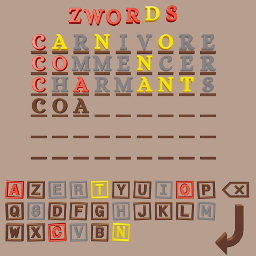

# zwords

ZWords is a Wordle (motus) like game written in [scala][scala] & [ZIO][zio]
for the backend. **Support only french words, english will come soon**.

- Play it : https://zwords.mapland.fr/
- API for AI Bots : https://zwords.mapland.fr/docs/

[scala]: https://www.scala-lang.org/
[zio]: https://zio.dev/
