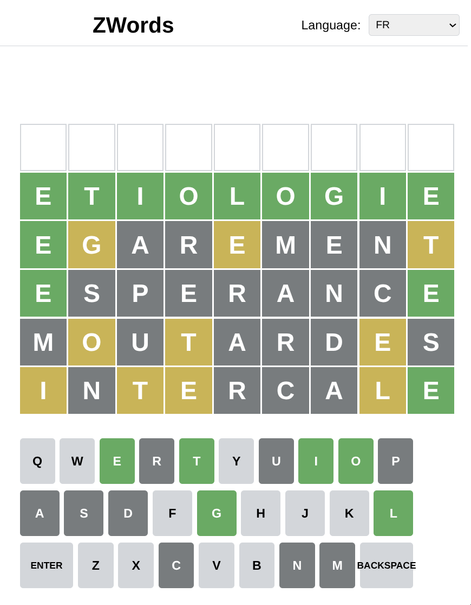

# UI prompts

## 2025-06-26

- minor improvements
- prompts history
  - Automatically update the shown keyboard layout depending on the currently selected  dictionary language: for `fr` based use AZERTY and for `en` based use QWERTY.
  - inverse backspace and enter key on the displayed keyboard
  - Add a logo and a favicon (based on the provided image `static-user-interfaces/logo.png`
  - Make the header and footer sections more colorful and enjoyable
  - edit the image `static-user-interfaces/images/logo.png` to make the white background transparent
  - it didn't work, the background is still white instead of being transparent

## 2025-06-25

- restart from scratch
- SWITCH to a .junie/guidelines.md and docs/requirements.md approach
- Prompt history
  - step1
    - Implement the user interface of this game - the backend is already started (do not execute `make run`) the API is available through this link: http://127.0.0.1:8090/docs/docs.yaml use curl to download it.
  - step2
    - widen the header and footer
    - in the displayed result summary, use several liens and not everything in the same one
    - played words order is wrong. reverse
  - step3
    - add player pseudo in the game result summary
    - put the just played game below the previously played one, currently it is added on top of it
    - when the game is won, show a winning message and the tried count
  - step4
    - already played words are still in reverse order!
  - step5
    - The game is won, but it is considered as lost (game over)
  - step6
    - on dictionary change, new daily word size can change, update the grid to have all the characters shown on the same line
  - step7
    - the first letter typed on the real keyboard is not taken into account, have to press the key two times
    - no the issue is still here have to press two times
    - it works fine for the first word, but for all others I have to press two times on the first letter I want
    - now it doesn't work for the first ones but it works fine for all others
  - step8
    - the results summary lines are in the reverse order, fix
  - step9
    - When game is finished ever won or lost, also display a message to invite the player to come back tomorrow for a new word to guess

## 2025-06-03

Enhance the user interface of this game which is defined in the directory `Create in a single file `static-user-interfaces/` by :
- Change Language label to Chosen directory
- Center the current player name
- Make the user interface more colorful, add some SVG graphics or icons

rename the label `chosen directory` to `chosen dictrionary`, fix spells if you can see issues

There is a resizing issue with the round box behind the main game play.

Adap the playing board to the size of the display, use raisonnable sizes, not too small and not too big. It should be playable using a smarphone or using a desktop computer.

this is OK for small sizes, but you can increase the size for bigger display. And there is an issue with the keyboard which overlapping the background box.

the keyboard lines must not be splitted into several ones, as it is with your latest changes. Keey the integrity of the qwerty keyboard.

for big display size, playground background box is not big enough to contain all the keys of the keyboard, some keys are partially hidden.

the width of the bounded box behind the game play is not wide enough to contain all the keys of the keyboard, fix that.

the keyboard still overlaps the white rounded box on the left and on the right

this is almost ok but with full screen navigators, the left and right parts of the keyboard are little bit clipped by the rounded white box

 

## 2025-05-28

### successive prompts

(continuing the previous junie session)

the user interface defined in the file `static-user-interfaces/index.html` must be enhanced :
- Change the backspace and enter keys into a svg icons as their texts are too long
- Make the user interface more fun by adding colors and animations
- Ask the user for a pseudo on first access, and keep this pseudo into the navigator.
- Align game title to the left and make it bigger and more fun

### results
probably too much animation !

## 2025-05-26

### successive prompts
Create in a single file `static-user-interfaces/index.html` a ready to play 
zwords game user interface:
- the game is wordle like game
- you have 6 tries max to guess the daily chosen secret word
- the user interface must be reactive
- for graphics SVG can be used.
- the game can be played with the keyboard or with the mouse
- show on the main page what is the current language/dictionary
- if language/dictionary is changed, take into account the new word to guess size
- The API documentation can be downloaded with the command `curl http://127.0.0.1:8090/docs/docs.yaml`
- display guessed words from older top to bottom newer
- use green for good place letter and orange for misplaced

the full word must fit in a single line 

the just entered new word must be shown below the previous one and not at the top

Save current selected language into current user navigator session

### results

good and playable

## 2025-05-26

### step 1
Create in a single file `static-user-interfaces/index.html` all the ready to play zwords game user interface, the user interface must be reactive, and for graphics use SVG. The API documentation is available at `http://127.0.0.1:8090/docs/docs.yaml`. The game is a wordle like game, you have 6 tries max to guess the daily chosen secret word, word size differs for each language, and one new word is chosen automatically by the server every day in the chosen language dictionary. Display on the main page what is the current language. Display each entered word, from top to the bottom.

### results

looks good but has bugs

